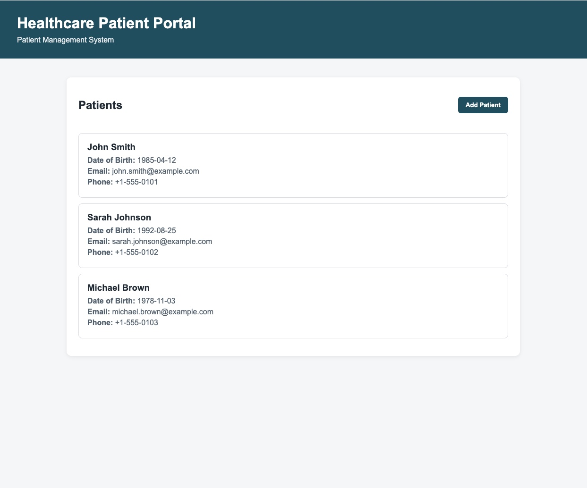
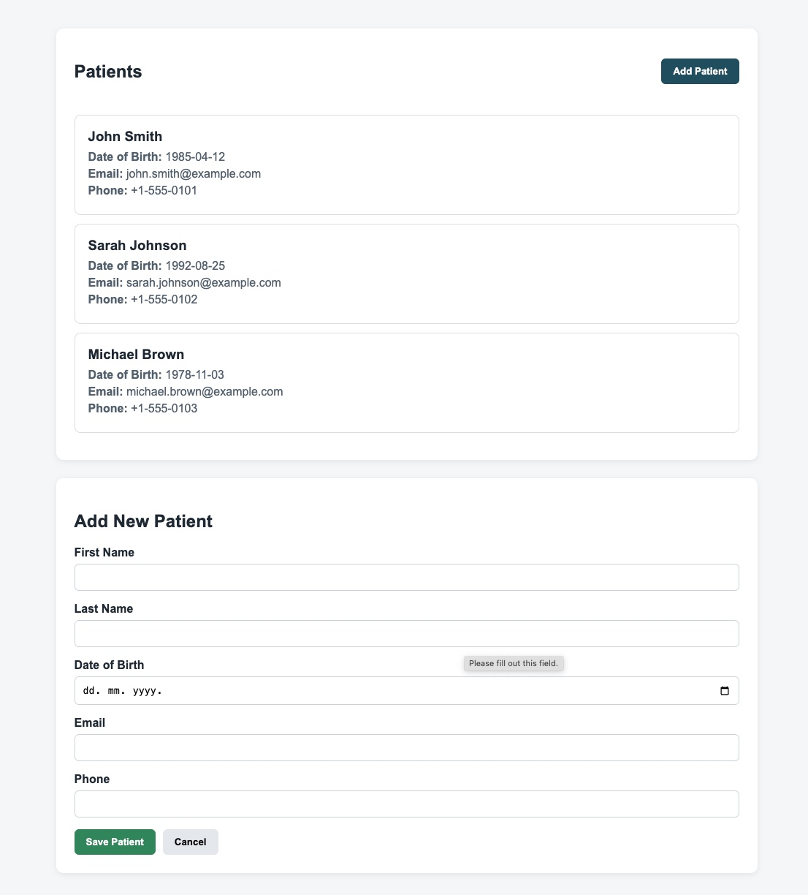

# QA Healthcare Automation

[](https://github.com/ema-ignjatovic-qa-engineer/qa-healthcare-automation/actions/workflows/playwright.yml)

A QA automation project built with **Playwright, TypeScript, Express.js and PostgreSQL** to demonstrate different levels of software testing in one application.

The project is a fictional healthcare application with a patient management API, PostgreSQL database, and a simulated POS payment flow.

The main goal is to demonstrate practical experience with **UI, API, database, integration, payment and end-to-end style testing**, together with automated test execution through GitHub Actions.

## Tech Stack

* Playwright
* TypeScript
* Node.js
* Express.js
* PostgreSQL
* pgAdmin
* Git / GitHub
* GitHub Actions

## Application

### Patient Portal



### Add Patient



### POS Payment Flow

The project also includes a simulated POS payment flow for testing payment-related scenarios.

The payment flow is connected to the backend API and PostgreSQL database rather than using a UI-only simulation.

## What is covered

### UI Testing

The UI tests cover the main patient management functionality:

* Viewing the patient list
* Searching for a patient
* Opening patient details
* Creating a patient
* Updating patient information
* Deleting a patient
* Basic form validation

Payment UI testing includes:

* Selecting a payment method
* Entering the payment amount
* Selecting a simulated processor result
* Submitting a payment
* Verifying a successful payment response

### API Testing

The REST API is tested using Playwright API requests.

Patient API coverage includes:

* GET patients
* GET patient by ID
* POST patient
* PUT patient
* DELETE patient

Negative scenarios include:

* Invalid patient ID
* Patient not found
* Missing required fields
* Duplicate email
* Invalid requests

#### Payment API Testing

The payment API includes positive and negative scenarios:

* Approved payment
* Declined payment
* Insufficient funds
* Expired card
* Payment timeout
* Processor error
* Missing required fields
* Invalid payment amount
* Unsupported payment method

The tests validate:

* HTTP status codes
* Response body
* Payment ID
* Order ID
* Amount
* Currency
* Payment method
* Processor result
* Payment status
* Timestamps
* Error responses

### Database Testing

PostgreSQL is used as the application's database.

Database tests validate:

* Patient records
* Searching for a patient by email
* Expected database values
* Data created through the API
* Payment records
* Payment status
* Payment amount
* Payment method
* Payment ID
* Order ID

For example, after creating a payment through the API, the test uses the returned `paymentId` to query PostgreSQL and verify that the transaction was persisted with the expected values.

### Integration Testing

The project includes API + database integration testing.

For example, a test creates a patient through the API and then checks PostgreSQL to verify that the record was actually stored with the expected values.

The test data is cleaned up after the test finishes.

Payment API tests also validate the integration between the API and PostgreSQL by verifying the created payment record in the database.

### Payment Testing

The project contains a simulated POS payment flow designed to demonstrate payment-related QA scenarios.

#### Payment Flow

```text
POS UI
   ↓
Payment API
   ↓
Mock Payment Processor
   ↓
Payment Result
   ↓
PostgreSQL
```

Supported payment methods:

* Card
* Contactless
* Cash
* Gift Card
* Digital Wallet

Simulated processor results:

* Approved
* Declined
* Insufficient Funds
* Expired Card
* Timeout
* Processor Error

Payment statuses include:

* `CAPTURED`
* `DECLINED`
* `TIMEOUT`
* `ERROR`

The payment API generates a unique payment ID and persists the transaction in PostgreSQL.

The project also includes a dedicated payment test plan:

`docs/payments/PAYMENT_TEST_PLAN.md`

The test plan covers functional scenarios, negative scenarios, validation, payment failures, integration points and database verification.

## Test Data and Fixtures

I use reusable test data and Playwright fixtures for scenarios where a patient needs to exist before the test starts.

The fixture creates a test patient through the API and removes it after the test.

This keeps the tests independent and avoids relying on permanent test data.

## Test Results

The project currently contains approximately **70 automated tests** covering UI, API, database, integration and payment scenarios.

The payment suite contains:

* **9 API payment tests**
* **1 UI payment test**
* **10/10 payment tests passing**

Example payment test command:

```bash
npx playwright test tests/api/payments.spec.ts tests/ui/payments.spec.ts --project=chromium
```

Run the complete test suite:

```bash
npx playwright test
```

## Running the Project

### Install dependencies

```bash
npm install
```

### Start the local API

```bash
npm start
```

The application runs on:

```text
http://localhost:3000
```

### Run all tests

```bash
npx playwright test
```

### Run tests with the browser visible

```bash
npx playwright test --headed
```

### Run API tests

```bash
npx playwright test tests/api
```

### Run UI tests

```bash
npx playwright test tests/ui
```

### Run payment tests

```bash
npx playwright test tests/api/payments.spec.ts tests/ui/payments.spec.ts --project=chromium
```

### Open the HTML report

```bash
npx playwright show-report
```

## GitHub Actions / CI

The project uses **GitHub Actions** to run the automated test suite.

The workflow is triggered on:

* Push to `main`
* Pull requests targeting `main`

The CI pipeline:

1. Checks out the repository
2. Sets up Node.js 22
3. Installs npm dependencies
4. Installs Playwright browsers and dependencies
5. Starts PostgreSQL
6. Creates the `qa_healthcare` database
7. Initializes the database schema
8. Starts the API
9. Runs the Playwright test suite
10. Uploads the Playwright HTML report as a workflow artifact

This allows the automated tests to run consistently in a clean CI environment.

## Project Structure

```text
qa-healthcare-automation/
│
├── api/
│   ├── data/
│   │   └── patients.js
│   ├── db.js
│   └── server.js
│
├── db/
│   └── init.sql
│
├── docs/
│   └── payments/
│       └── PAYMENT_TEST_PLAN.md
│
├── scripts/
│   └── bulk-create-patients.ts
│
├── tests/
│   ├── api/
│   │   ├── patients.spec.ts
│   │   └── payments.spec.ts
│   │
│   ├── database/
│   │   ├── db.ts
│   │   └── patients.db.spec.ts
│   │
│   ├── integration/
│   │   └── patients.integration.spec.ts
│   │
│   ├── ui/
│   │   ├── patients.spec.ts
│   │   └── payments.spec.ts
│   │
│   ├── fixtures/
│   │   └── patient.fixture.ts
│   │
│   └── helpers/
│       └── test-data.ts
│
├── web/
│   ├── app.js
│   ├── index.html
│   └── styles.css
│
├── .github/
│   └── workflows/
│       └── playwright.yml
│
├── playwright.config.ts
├── tsconfig.json
├── package.json
└── README.md
```

## QA Approach

The project demonstrates a combination of:

* Functional testing
* Positive and negative testing
* API testing
* UI testing
* Integration testing
* Database validation
* End-to-end style testing
* Boundary and validation testing
* Payment failure scenarios
* Automated regression testing
* CI execution

The focus is not only on verifying the UI, but also on validating the communication between application layers and the data stored in the database.

## Why I Built This

I wanted to have one project where I could practice and demonstrate more than just UI automation.

The project gave me the opportunity to work with:

* Playwright and TypeScript
* REST APIs
* SQL and PostgreSQL
* API/database integration
* Test data and fixtures
* Negative testing
* Payment testing
* Git and GitHub
* CI with GitHub Actions

The application and all patient data in this project are fictional and created for testing purposes only.

## Future Improvements

Potential future improvements include:

* Refund and void payment scenarios
* Payment status inquiry
* Idempotency testing
* Webhook testing
* Additional end-to-end payment scenarios
* API schema validation
* Authentication and authorization testing
* Expanded test reporting and CI artifacts

## Author

**Ema Ignjatović**

QA Engineer focused on software testing, API testing, test automation and Quality Engineering.
